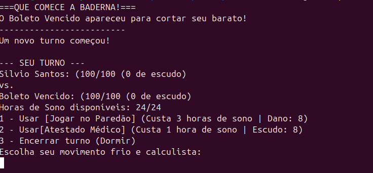

# 🎮 HueHue Br! Duel Game - Tarefa 2 (MC322)

Um jogo de duelo via terminal baseado em memes e na cultura popular brasileira, desenvolvido para a disciplina **MC322 - Programação Orientada a Objetos** na UNICAMP.

---

## 📖 Sobre a Tarefa 2
Nesta etapa, o projeto foi refatorado para aplicar conceitos avançados de **POO**, eliminando repetições de código e implementando uma mecânica de *deckbuilding* inspirada em jogos como *Slay the Spire*.

### Evolução do Sistema:
* **Hierarquia de Classes:** Implementação das classes abstratas `Entidade` e `Carta`.
* **Mecânica de Baralho:** Sistema real de Pilha de Compra, Mão e Descarte.
* **Ciclo de Jogo:** Embaralhamento automático do descarte quando o baralho de compra esgota.
* **Inteligência do Inimigo:** O oponente agora anuncia suas intenções de ataque antes do turno do jogador.

---

## 🏗️ Arquitetura do Projeto

Abaixo, a estrutura de herança aplicada para atender aos requisitos da disciplina:


*(Representação da nova hierarquia: Entidade -> Heroi/Inimigo | Carta -> Dano/Escudo)*

### 👤 Entidades
* **`Entidade` (Abstrata):** Gerencia `vida`, `nome` e o sistema de `escudo` (cafeína/migué).
* **`Heroi`:** Controla as **Horas de Sono** e restaura recursos a cada turno.
* **`Inimigo`:** Base para oponentes como o `Boleto`, que agora avisam o dano antes de atacar.

### 🃏 Cartas
* **`Carta` (Abstrata):** Base para todas as ações do jogador.
* **`CartaDano`:** Cartas ofensivas que consomem sono para causar dano.
* **`CartaEscudo`:** Cartas defensivas que geram escudo para mitigar o próximo ataque.

---

## 🚀 Quick Start - Como Compilar e Executar?

Utilize os comandos abaixo na raiz do projeto:

### 1. Compilar os arquivos-fonte
```bash
javac -d bin $(find src -name "*.java")
```

### 2. Como executar o programa
```bash
java -cp bin App
