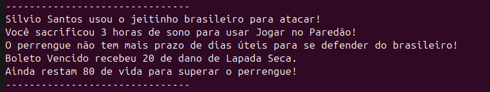

# HueHue Br! Duel Game
Um jogo de duelo simples via terminal, baseado em memes e na cultura popular brasileira 


## Quick Start - Como Copilar?
### 1.  Compilar os arquivos-fontes
```bash
javac -d bin $(find src -name"*.java")
```
### 2. Executar o programa
```bash
java -cp bin App
```
### 3. Interagir com o terminal

```bash
1
```


```bash
2
```

```bash
3
```

```bash
4
```


Boa diversão!